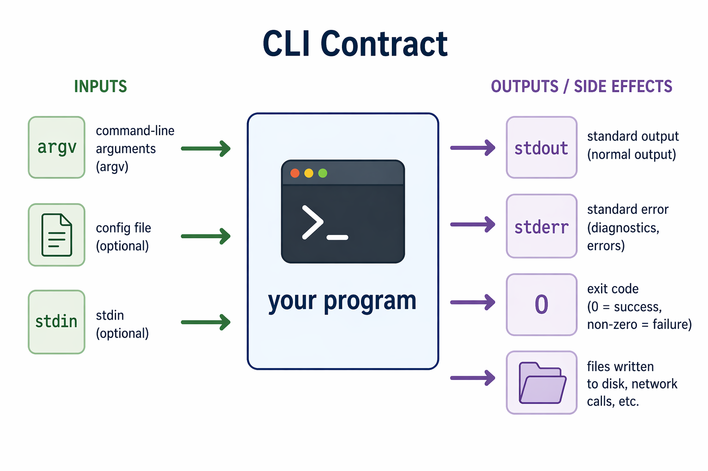
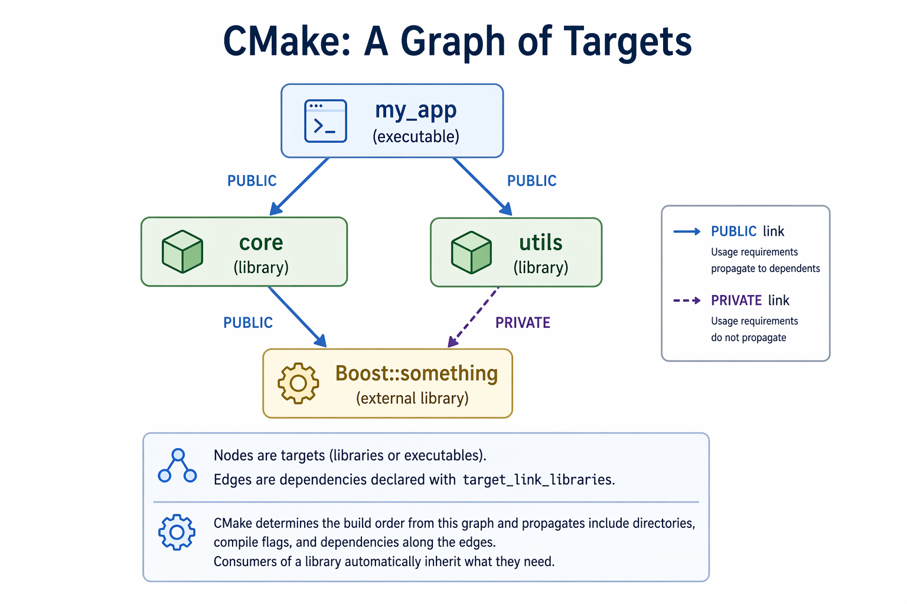
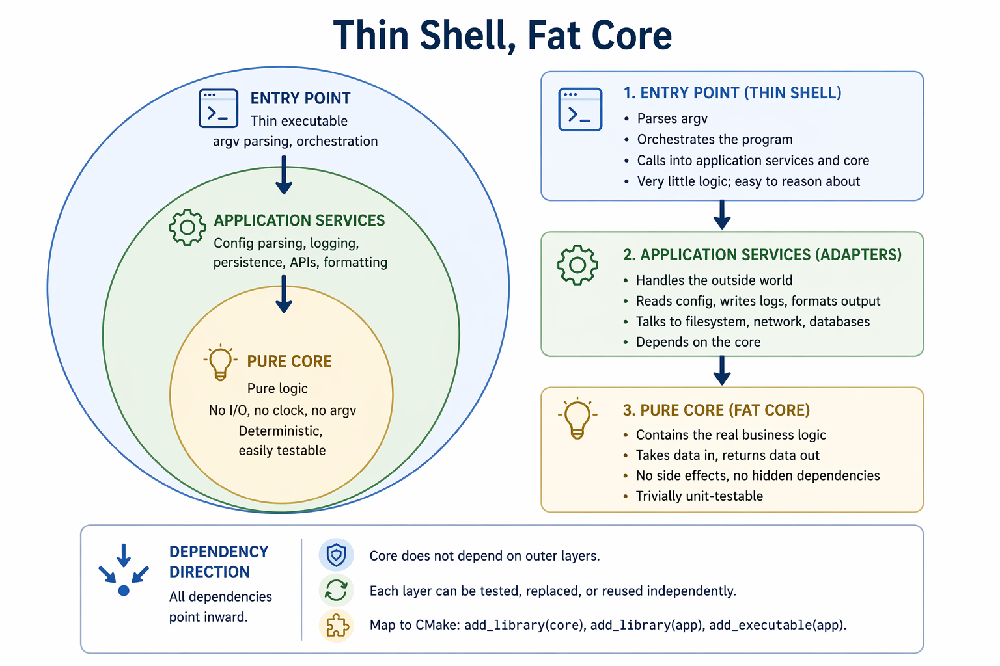

# C++ CLI Tooling

A short tour of the ideas behind command-line tools in modern C++ — a clean input/output contract, a CMake target graph, a pure logic core wrapped in a thin I/O shell, a library-parsed configuration surface, and disciplined error reporting. These patterns show up in almost every production project, from embedded firmware to million-line desktop applications, and once they become reflexive they scale without changing shape.

---

## 1. What a CLI Tool Is

A command-line tool talks to the outside world through a deliberately small interface — a handful of input channels (`argv`, config files, `stdin`), a few output channels (`stdout`, `stderr`, an exit code), and whatever side effects it chooses to have on disk or the network.



The contract is simple on purpose. It makes CLI tools **composable** — you can pipe them together, script them, call them from CI, and automate them — as long as you respect the conventions. A program that prints errors to `stdout` or exits `0` on failure breaks scripts silently, which is worse than crashing loudly.

Three layers of configuration are common, in order of precedence:

1. **Command-line flags** — per-invocation overrides (`--verbose`, `--port 8080`)
2. **Config files** — persistent settings, versioned alongside code (INI, TOML, YAML, JSON)
3. **Defaults** — what the program does when you give it nothing

Good tools let you override anything from the layer above.

---

## 2. CMake: A Graph of Targets

The biggest mental shift in modern C++ is moving from "compile a bunch of files" to **thinking in targets.** A CMake project is a graph whose nodes are **targets** — libraries (`add_library`) or executables (`add_executable`) — and whose edges are **dependencies** declared with `target_link_libraries`.

CMake figures out the build order from the graph. It also propagates include directories, compile flags, and dependencies along the edges, so consumers of a library automatically inherit what they need.



In this graph, a **PUBLIC** link means a dependency becomes part of a target’s exposed interface, so anything that depends on that target also inherits its include paths, compile settings, and linked libraries. A **PRIVATE** link means the dependency is only used internally by that target and does not propagate to downstream consumers. In the diagram, `core` publicly exposes its dependency on `Boost::something`, while `utils` uses Boost only as an internal implementation detail.

A minimal example:

```cmake
cmake_minimum_required(VERSION 3.15)
project(my_app CXX)
set(CMAKE_CXX_STANDARD 17)

add_library(core src/core.cpp)
target_include_directories(core PUBLIC include)

add_executable(my_app src/main.cpp)
target_link_libraries(my_app PRIVATE core)
```

---

## 3. Pulling in External Libraries

Real C++ projects rarely live in isolation — they pull in libraries like Boost, Eigen, fmt, spdlog, or gRPC. CMake's `find_package` locates an installed library on your system and exposes it as one or more **imported targets** you can link against:

```cmake
find_package(Boost REQUIRED COMPONENTS program_options)

target_link_libraries(my_app PRIVATE Boost::program_options)
```

The `Boost::program_options` target carries its include paths, compile definitions, and link flags with it. You don't hand-manage header search paths or `-l` flags.

If the package is missing, CMake fails at the configure step with a useful message. That's what you want — failing early at configure time is much friendlier than failing later at link time with a cryptic error.

---

## 4. Parsing Arguments and Config Files

You *can* parse `argv` by hand. Don't. Use a library. The general pattern across every options library in every language is the same three steps:

1. **Describe** the options you accept (name, type, default, help text).
2. **Parse** an input source (`argv`, a config file, or both) into a parsed map.
3. **Query** values out by name, with types enforced.

In C++, **Boost.Program_options** is a standard choice. It handles short and long flags, defaults, required values, and conveniently uses the same `options_description` to parse INI-style config files too. Declare your options once, parse whatever sources you need into a `variables_map`, then read values out of it.

The important habit is **separating "what options exist" from "where they came from."** A user shouldn't have to care whether `--port 8080` arrived via a flag, a config file, or a default. The library handles that for you.

---

## 5. Thin Shell, Fat Core

The most durable architectural pattern in CLI tools — and in most software — is to **keep your core logic pure and your I/O at the edges.**



A well-structured CLI typically separates into three layers: a **pure core** of deterministic business logic with no filesystem, clock, network, or `argv` dependencies; an **application-services** layer of adapters that handle config, logging, persistence, formatting, and external APIs; and a **thin executable** — a minimal entry point that parses arguments, wires dependencies together, and invokes the core.

Dependencies flow inward: outer layers depend on inner layers, but the core depends on nothing external. That's what keeps the business logic reusable, testable, and portable across interfaces. In CMake it maps naturally to separate targets — one `add_library` for the core, one for services, and a small `add_executable` at the boundary.

---

## 6. Errors and Exit Codes

A final set of Unix conventions worth drilling in:

- **Exit `0` on success, non-zero on failure.** Scripts, CI, and other programs depend on this. A silent non-zero is fine; a loud `0` after a crash is a bug.
- **Diagnostics and errors go to `stderr`, not `stdout`.** Normal output goes to `stdout`. Mixing them up breaks piping and makes failures invisible to automation.
- **Errors should say what went wrong and, if possible, what to do about it.** `"Config file 'foo.ini' not found"` is useful. `"Error"` is not.

The typical C++ idiom is to wrap `main`'s body in a `try` block, catch `std::exception` and any library-specific error types, print to `std::cerr`, and `return 1`:

```cpp
int main(int argc, char** argv) {
    try {
        // ... real work here
        return 0;
    } catch (const std::exception& e) {
        std::cerr << "error: " << e.what() << "\n";
        return 1;
    }
}
```

This one pattern covers the vast majority of CLI error-handling needs.

---

## Assignment

Apply these ideas in a small simulation: the **Satellite Temperature Monitor** — a C++/CMake project that reads two redundant sensors, averages them each step, and flags out-of-range faults. Target names, CLI forms, and output files are spec'd so the autograder can check your work on every push. The repo ships with a `run_tests.py` script that runs those same tests locally (`python3 run_tests.py`) — the GitHub Actions workflow just invokes it too, so local pass = CI pass.

**If you're enrolled at Georgia Tech:** accept the assignment through the [GitHub Classroom invite](https://classroom.github.com/a/N-EvfSqK). Classroom will create your personal repo under the [gtcloudrobotics](https://github.com/gtcloudrobotics) org — clone *that* repo (not the public template) and work there. Results auto-report to the instructor dashboard as your grade.

**If you're not enrolled:** go to [gtcloudrobotics/satellite-temperature-monitor](https://github.com/gtcloudrobotics/satellite-temperature-monitor), click **Use this template** to make your own copy, then clone and push. The autograder runs on every push; you'll see pass/fail in the Actions tab.
