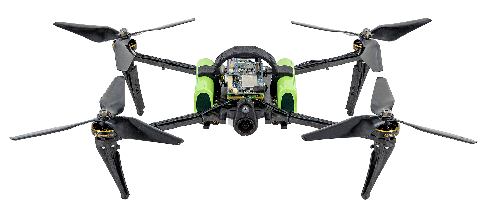

# Modular Autonomy Framework

<figure markdown="span">
  
  <figcaption>ModalAI Starling 2 — initial target platform for MAF deployment.</figcaption>
</figure>

**MAF** is a pure C++ onboard autonomy framework — no ROS, no middleware bloat, just direct autopilot control with behavior tree orchestration. [MAF Aerial](https://github.com/EthanMBoos/maf_aerial) is the first domain implementation, targeting PX4 via MAVLink.

Production autonomy stacks (PX4, Waymo, Skydio) converge on the same pattern: **C++ internally, serialize only at boundaries**. MAF follows that pattern so the same binary runs under SITL and on constrained hardware like the ModalAI VOXL 2, configured by a YAML hierarchy (defaults → domain → platform → vehicle). Missions run as BehaviorTree.CPP graphs with reactive failsafes, and the vehicle plugs into [Tower](tower.md) by publishing a protobuf extension payload to tower-server.

```text
┌──────────────┐   MAVLink    ┌──────────────┐   Protobuf    ┌──────────────┐
│   Autopilot  │ ◀──────────▶ │     MAF      │ ◀───────────▶ │    Server    │
│    (PX4)     │              │   (C++/BT)   │   extension   │     (Go)     │
└──────────────┘              └──────────────┘               └──────────────┘
```

!!! tip "Dive deeper"

    Read the [MVP plan](https://github.com/EthanMBoos/maf_aerial/blob/main/docs/MVP_PLAN.md) or the [architecture decisions](https://github.com/EthanMBoos/maf_aerial/blob/main/docs/ARCHITECTURE_DECISIONS.md) behind the pure-C++ approach.
