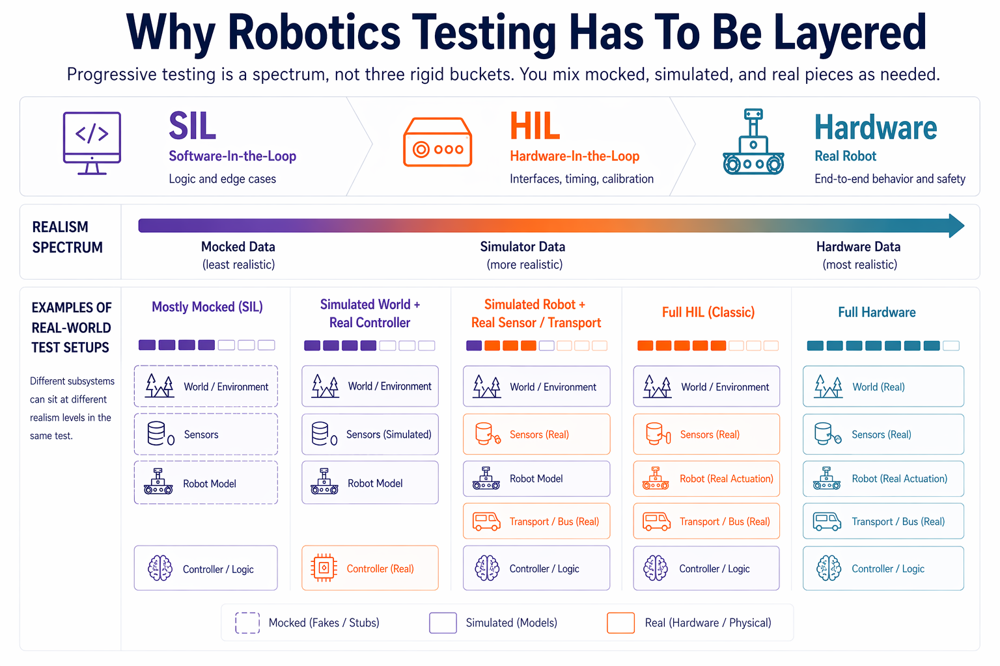

# Progressive Testing

Progressive testing is the discipline of building confidence in a robot step by step instead of betting everything on a hardware run. The idea is simple: prove behavior in cheap environments first, keep the contract stable as realism increases, and only spend real hardware time on failures that could not have been caught earlier.

---

## 1. Why Robotics Testing Has To Be Layered

Robotics adds sensors, actuators, timing, noisy data, and hardware you can break. If your first serious test is on the robot itself, you are learning too slowly and too expensively.

That is why teams test in layers, moving from cheap and repeatable environments toward expensive and realistic ones. Most bugs should die before they ever reach hardware. No one layer does every job: SIL will never tell you everything about the real world, and hardware will never be the cheapest place to find logic bugs.

---

## 2. Software-In-The-Loop: Prove The Logic First

In **software-in-the-loop**, the robot is mostly replaced with code. Sensors are mocked or simulated, actuators are replaced with fakes, and time is often controlled by the test harness.

This is where you should catch:

- incorrect state-machine transitions
- bad threshold logic
- failure to handle stale or missing data
- unsafe command generation
- obvious planner or controller regressions

SIL is fast, repeatable, and easy to run in CI. It is the best place to test behavior that does not depend on real hardware effects.

The architectural lesson is the same one that shows up everywhere else in robotics: keep the decision-making core separated from the hardware boundary. If your logic can only run when a real camera, serial port, or motor driver is attached, you made it harder to test than it needed to be.

---

## 3. Hardware-In-The-Loop: Keep The Interfaces Honest

In **hardware-in-the-loop**, some part of the real hardware path comes back into the loop. Maybe the controller is real but the world is simulated. Maybe the sensor is real but the plant is not. Maybe the software uses the real transport stack while the test harness injects controlled inputs.

This layer exists because mocks are liars in a very specific way: they only behave how you imagined the interface would behave.

HIL is where you catch:

- timing assumptions that were invisible in unit tests
- transport or serialization mistakes
- bad calibration or scaling assumptions
- interface mismatches between software and devices
- control behavior that looks fine in logic tests but breaks under real update timing

HIL should be smaller and more selective than SIL. You are not repeating every software test. You are checking the assumptions that only become visible once a real interface is involved.

---

## 4. Hardware Tests Are The Final Authority, Not The First Line Of Defense

Real hardware testing matters because the real world always wins. Friction is wrong, lighting changes, sensors drift, connectors wiggle, and the environment does not care what your mocks said.

But hardware is the most expensive place to debug. It is slow to set up, hard to reproduce, and the wrong place to find basic logic bugs for the first time.

Hardware tests should answer questions like:

- does the full system behave safely in the real environment?
- do latency, vibration, lighting, or noise break our assumptions?
- do the operator workflow and failure modes still make sense on the actual platform?

If a bug could have been found in SIL, finding it on the robot is not proof of realism. It is proof that the earlier layers were too weak.

---

## Assignment

!!! warning "Assignment under construction"
    This stub is a placeholder and hasn't been written yet. Check back later for content.
