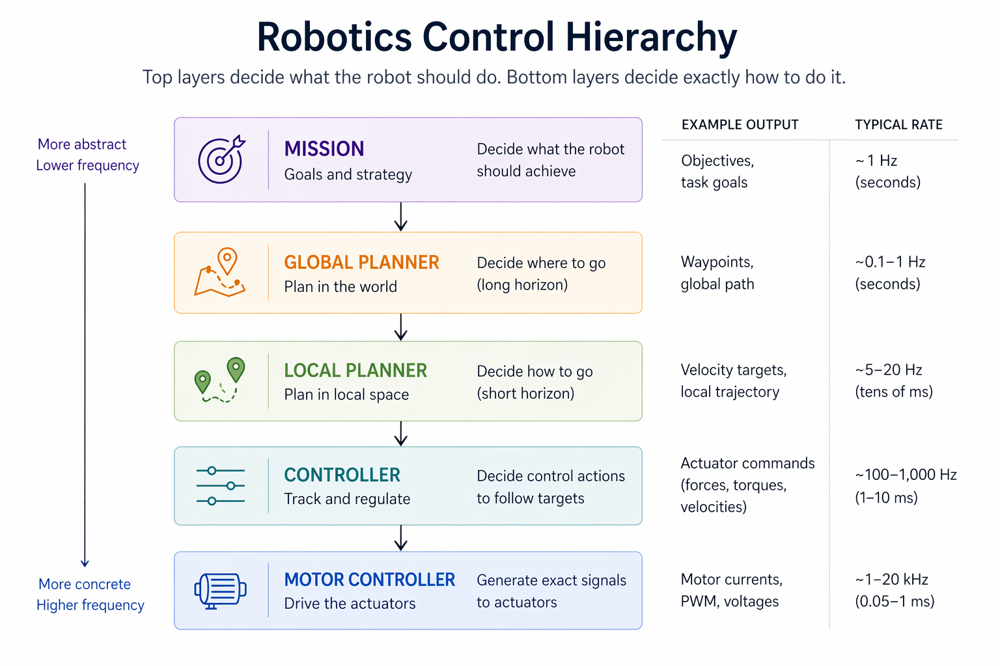
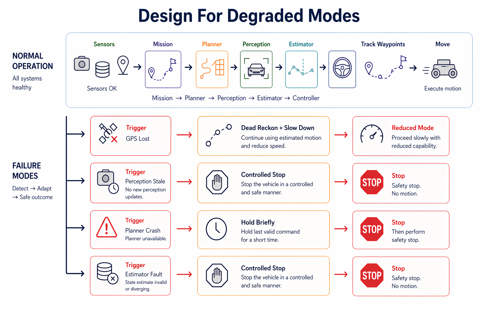

# System Design

System design is the top-level view of a robot: what the major pieces are, what each is responsible for, how they exchange information, and why they run at different rates. If you can look at a robotics stack and explain where sensing ends, estimation begins, how planning hands off to control, and what happens when data goes stale, you can reason about the system before reading a line of code.

---

## 1. A Robot Is Not One Loop

The first mental shift in robotics system design is giving up the idea that a robot is one big loop that reads sensors, makes a decision, and sends commands. Real robots are usually several loops running at different rates because different parts of the problem live on different time scales.

A robot is rarely a single sense–think–act loop. High-level mission logic may update only once per second, planners recompute paths periodically, perception runs at sensor rate, state estimation tracks system dynamics continuously, and controllers stabilize motion at very high frequency. Slower layers decide what the robot should do; faster layers decide how to do it.

| Layer | Purpose | Typical Rate | Why |
| --- | --- | --- | --- |
| Controller | Stabilize motion | 1 kHz | Needs tight feedback |
| Estimator | Track state | 100 Hz | Follows dynamics |
| Perception | Interpret sensors | 30 Hz | Sensor + compute bound |
| Planner | Compute path | 5 Hz | Longer horizon reasoning |
| Mission | Goals & strategy | 1 Hz | Human/task timescale |



The exact rates vary across robots, but the overall pattern does not: control runs fastest, estimation follows the dynamics, perception is bounded by sensors and compute, and planning and mission logic run more slowly because they reason over longer horizons. Those differences come from physics, latency, and system requirements, not coding style.

Two distinctions matter early. Perception is not estimation: detecting a lane marker is different from estimating vehicle pose. And planning is not control: deciding where to go is different from generating the fast actuator commands that make the robot follow that decision.

---

## 2. Interfaces Are The Real Architecture

System design is mostly boundary design. Modules stay swappable only when their interfaces are clean: inputs are explicit, outputs are typed, and responsibilities do not leak across layers.

```text
Good:
camera -> perception -> planner -> controller

Bad:
camera -> planner
UI -> controller
controller -> map internals
```

Good boundaries let you replace a camera, planner, or estimator without rewriting the rest of the stack. Bad boundaries create hidden coupling: a planner reaches into sensor internals, a UI writes actuator commands directly, or a controller depends on map-building details it should never know about. This is why robotics diagrams matter. They are not decoration; they expose ownership boundaries.

---

## 3. Rate, Latency, And Freshness Budgets

Once the modules are separated, the next question is not just *what talks to what*, but *how fast* and *how stale is still acceptable*. Every important module has both a nominal rate and a latency budget.

| Module | Typical Rate | If Stale... |
| --- | --- | --- |
| Controller | ~1 kHz | Tracking degrades immediately |
| Estimator | ~100 Hz | Downstream state becomes wrong |
| Perception | ~10-30 Hz | World model goes stale |
| Planner / mission | ~1-5 Hz | Robot can often coast briefly |

A 1 kHz controller should not block waiting on a 30 Hz perception output. A planner can update slowly as long as a faster lower layer can keep the robot stable in the meantime. A stale pose estimate, on the other hand, can poison everything downstream. In robotics, a perfect answer that arrives too late is often worse than a rough answer that arrives on time.

---

## 4. Design For Degraded Modes

The final question in any system design is not just "how does this work when everything is healthy?" but "what happens when part of it breaks?" Real systems need an answer for dropped sensors, delayed perception, crashed planners, and stale state.



This is where safety authority becomes explicit. A well-designed system makes clear which module can command a stop, which inputs are optional, and which failures require an immediate fallback. Some faults should trigger a controlled stop; others should degrade performance while keeping the robot stable. The point is not to avoid failure entirely, but to make sure failure leads to known behavior instead of surprises.

---

## Assignment

!!! warning "Assignment under construction"
    This stub is a placeholder and hasn't been written yet. Check back later for content.
