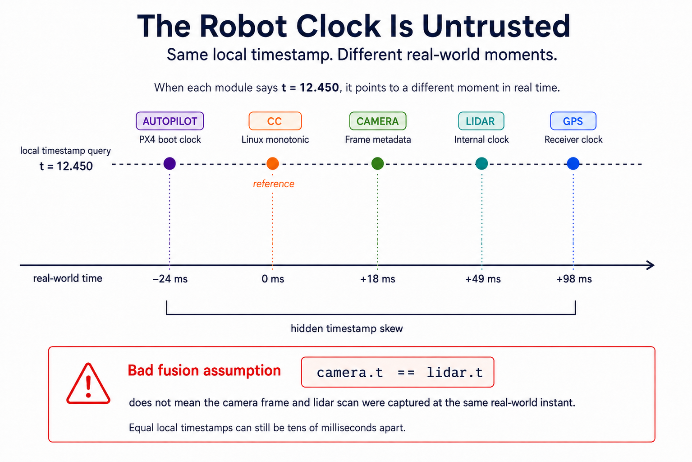
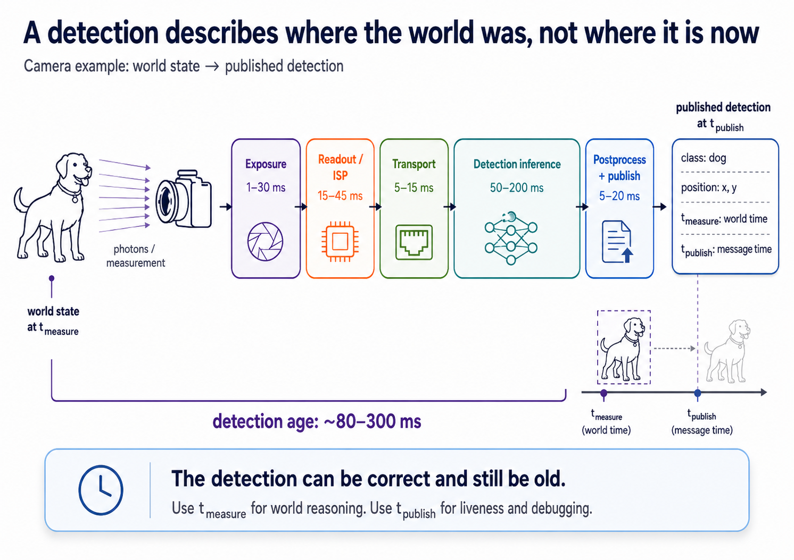
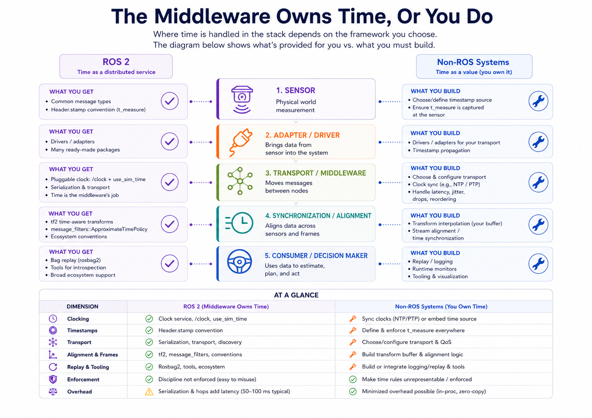

# Time Alignment

Every sensor reading on a robot is a pair: *what* was measured, and *when*. The "what" gets all the calibration attention. The "when" is where the silent bugs live.

If two modules disagree on what "now" means by even a few tens of milliseconds, the data they produce no longer describes the same world. Downstream fusion and control still produce confident outputs — about a scene that never existed. **Time alignment is the discipline of keeping that gap closed** across every clock, timestamp, and processing delay on the robot.

The trickiest of these bugs live *inside a single robot*. The autopilot, mission computer, perception nodes, and sensor firmware each have their own clocks. None agree; none are wrong in their own frame. Cross-link alignment between robots is a related but separate problem with well-known distributed-systems answers (NTP, PTP, minimum-RTT filtering); this lesson focuses on the on-robot case where the silent bugs hide.

---

## 1. Pick One Canonical Clock

There is no "the robot's clock." A typical platform has four or five independent clocks: the autopilot's, the mission computer's, each camera's, the lidar's, and the GPS. Each starts at a different instant, drifts at its own rate, and is authoritative in its own frame.



The bug that costs you a flight: two modules both stamp their data with what they each call "t = 12.450", and a fusion node treats those as the same instant. The lidar and camera detections might be 80 ms apart in reality. The perception stack happily projects lidar points into a camera frame captured during a different part of the maneuver. The fused output looks reasonable. It's wrong.

The fix is the same boundary discipline from [system design §2](system-design.md#2-interfaces-are-the-real-architecture) and [the adapter pattern in progressive testing](progressive-testing.md#5-dont-let-hardware-patches-poison-the-core): **treat the timestamp as part of the sensor reading, and convert it at the adapter.** Every message from a module with its own clock gets re-stamped into a single canonical robot time. Downstream code only ever sees canonical time. No fusion node ever asks "whose clock is this?" because the answer is always the same.

---

## 2. Reconcile By Measured Offset, Not By Hope

Re-stamping at the adapter only works if you know the offset between each module's clock and the canonical one. The wrong answers: assume it's zero, or measure it once at boot. Offsets drift. At 20 ppm, a clock loses a millisecond per minute, so a boot-time alignment is wrong by tens of milliseconds within an hour.

The standard fix is a continuous ping-pong, used by MAVLink's `TIMESYNC` and PTP's two-step:

```
companion → autopilot: "here is my t_cc = T1"
autopilot → companion: "I received it at my t_ap = T2, replying at my t_ap = T3"
companion receives reply at t_cc = T4

half_rtt = ((T4 - T1) - (T3 - T2)) / 2
offset_ap_to_cc = T2 - (T1 + half_rtt)
```

Run this every second, low-pass filter the result, and you have a continuously-updated "autopilot time minus companion time" that tracks drift. Each autopilot message gets its timestamp converted by adding that offset. Done well, the canonical frame stays accurate to the jitter of the link itself — sub-ms on UART, low-ms on USB, microseconds on PTP-capable Ethernet.

The same idea applies to every other module. The camera reconciles by triggering off a known signal and measuring the offset between "trigger fired" and "frame metadata says it fired." The lidar reconciles by wiring its PPS input to the GPS PPS and treating GPS-disciplined PPS edges as ground truth. Each adapter runs its own offset estimator.

A few things that catch people:

- **Boot-time convergence.** The first few seconds of data are stamped with whatever initial guess the estimator used. Either gate publishing until the offset stabilizes, or attach a confidence flag so consumers can decide.
- **Re-stamping loses provenance.** Always carry both timestamps: the original in the source clock, and the converted one in canonical time. Debugging a sync bug without the originals is nearly impossible.
- **Don't re-stamp at publish.** A planner that subscribes to a pose, runs for 30 ms, and publishes a trajectory stamped with `now()` has lost the information about *when its input was measured*. Carry the source timestamp through; stamp publish time separately if you need it.

**Characterization.** Online, continuous, analytical. No bench tests, no per-unit calibration. The ping-pong runs at ~1 Hz forever, and the filter tracks slow drift while rejecting RTT spikes. Per-unit oscillator variance is absorbed automatically — the algorithm only tracks the running difference, so it doesn't care whether module A drifts at +18 ppm and B at -23 ppm. The only design choices are the filter constants and the boot-time gate.

Clock reconciliation is only half of the adapter's job. The other half — recovering *when the measurement actually happened*, not just when its message arrived — is the harder problem most teams skip.

---

## 3. A Detection Is Older Than Its Timestamp Says

Even after the clocks agree, the timestamp on a detection rarely says what you think. A camera detection at canonical t = 12.450 doesn't mean "an object was at this location at t = 12.450." It means "we finished computing a detection at t = 12.450, about a world that existed some time earlier." How much earlier is the difference between dodging an obstacle and reacting to where it used to be.

Every sensor pipeline costs time at every stage:



That total isn't theoretical. A detection arriving "right now" describes a world that existed 80–300 ms ago, depending on model and lighting. A controller that takes the timestamp at face value — even with perfectly reconciled clocks — reasons about an obstacle's location that's already wrong by however far the obstacle moved during the pipeline.

The fix is to put two timestamps on every message:

- **`t_measure`** — when the world was in the state this message describes. Exposure midpoint for a camera detection; start-of-scan for a lidar frame; GPS fix epoch for a position update.
- **`t_publish`** — when this specific message was emitted. Useful for liveness checks ("haven't seen a detection in 200 ms"), network debugging, and ordering. Not for reasoning about *the world*.

Each adapter computes `t_measure = t_publish - sum_of_known_stage_latencies`. The latencies are measured per pipeline, not guessed. A camera with 20 ms exposure and 60 ms detection publishes with `t_measure = t_publish - 0.080`. If a stage's latency varies (say, inference time depends on scene complexity), the adapter measures it per-frame. If recovery is impossible, record an uncertainty band — not a confident-looking guess.

!!! note "Spinning lidar: per-point, not per-message"
    A spinning lidar's points are spread across the scan — on a 15 m/s UAV, the platform moves 1.5 m during one 100 ms scan, so points acquired late in the scan are reported in a body frame the robot has already left. Motion-compensating the scan (re-projecting each point using the IMU trajectory across the scan window) is part of the adapter's job, not the planner's.

Once `t_measure` exists on every message, downstream code can finally do honest math. A planner extrapolates an obstacle's track forward from `t_measure` to "now" instead of treating a 200 ms-old position as current. A controller decides whether a detection is fresh enough to act on. A logger replays events in the order they happened in the world, not the order they hit the bus.

**Characterization.** Three layers, each measured directly:

- **Software stages you control.** Instrument with `t_in`/`t_out` per node; the adapter sums them. Online, per-frame, tracks load variation for free. ROS 2 and MAVLink have hooks; add them if yours doesn't.
- **Sensor-internal stages (exposure, readout, ISP).** Sealed, so you can't probe directly. Bench-flash an LED and histogram the arrival latency, or trust the sensor's embedded timestamp once §2 has reconciled its clock. In practice, both: embedded for the bulk, a bench offset for whatever the firmware misses.
- **Per-unit variance.** Ignorable for sensors (same-model units rarely differ by >5%). Actuators are the opposite. Motor response varies unit-to-unit, which is why PX4 stores motor time constants per *vehicle*. Sensors: per-model. Actuators: per-unit, at commissioning.

No ML — the structure is fixed, and direct instrumentation beats any learned estimator.

---

## 4. Reaction Loops Have An End-To-End Budget

Once every message carries `t_measure`, the next question is *how stale is the freshest information the controller can act on?* Every closed-loop reaction has a floor: photons hit the sensor, the pipeline runs, the planner reacts, the controller computes, the actuator physically responds.

A realistic obstacle-avoidance loop on a UAV:

| Stage | Latency |
| --- | --- |
| Photons → camera detection ready (§3) | 80–300 ms |
| Detection → planner (transport + queueing) | 5–20 ms |
| Planner inference (5 Hz nominal) | 20–100 ms |
| Trajectory → controller (transport) | 1–10 ms |
| Controller computation | 1–5 ms |
| Controller → ESC / servo | 5–20 ms |
| Motor / aerodynamic response | 50–200 ms |
| **Total: photons → measurable response** | **~160–650 ms** |

At 15 m/s, a UAV covers 2.4–9.8 m during that window. That's the *minimum* standoff distance the system can guarantee against a static obstacle that appears suddenly. Anything closer is past the loop's ability to react, no matter how clever the planner is.

Three consequences fall out:

1. **The slowest stage sets the envelope.** Doubling the controller's rate from 200 Hz to 1 kHz buys ~4 ms. Halving the detection model's inference from 200 ms to 100 ms buys 100 ms. Leverage lives in the dominant stage, and that stage is almost never the controller.
2. **Planners must extrapolate, not interpolate.** The freshest detection is already 100–300 ms old, and the controller acts on it 30–100 ms later. A trajectory through "where the obstacle is now" actually targets where it *was*. Plan against the obstacle's projected position at the actuation moment, using `t_measure` and a tracked velocity.
3. **Reaction-time bugs hide in the slowest pipeline.** If perception dominates at 250 ms and someone shaves the planner from 80 ms to 20 ms, total reaction time barely moves — but a casual review might claim "we halved planner latency" as if the robot were now twice as responsive. Budget the whole pipeline.

This ties back to [system design's freshness budgets](system-design.md#3-rate-latency-and-freshness-budgets): every consumer publishes the maximum measurement age it tolerates, every producer publishes its actual end-to-end latency, and integration confirms the budgets close. When they don't, either reduce the slowest stage or widen the standoff envelope. Never pretend the loop is faster than the math allows.

**Characterization.** *Compose* the budget; don't measure it end-to-end. A synthetic-obstacle test that triggers a known event and times the response sounds rigorous, but it needs a controlled environment and just reproduces the §3 sum. Add the per-stage software and sensor numbers from §3, plus actuator response from airframe commissioning (motor time constants on a UAV, drivetrain response on a ground vehicle).

What you *do* measure across the loop is the **distribution**, and from logged flights, not bench tests. Over a representative mission, log every stage's `t_in`/`t_out`, sum per frame, and histogram the total. The **99th percentile is your design number**, not the median. The median tells you what usually happens; standoff distances have to survive the bad frames, not the typical ones. A median of 200 ms with a 99th-percentile of 500 ms has a 500 ms budget — pretending otherwise is how you get a collision on the one frame the GPU stalled.

Re-characterize whenever you change a detection model, swap a sensor, refactor a hot path, or move to a different airframe variant. Re-log on a schedule even when nothing changed, because compute regressions silently widen the tail — background services waking up, thermal throttling mid-flight, OS upgrades quietly adding kernel work. Treat the 99th-percentile budget as a CI metric: if a software change widens it, you've regressed.

---

## 5. Characterize Cold, Loaded, Long, And Live

The Characterization blocks in §§2–4 say *what* to measure. They don't say *under what conditions*, and the answer is "all of them, in a specific order." Each condition reveals a different class of bug. Bench numbers from an idle robot are a starting point, not a finish line.

**Stage 1: Cold, composed.** Power the robot on, run nothing else, measure each stage in isolation. The camera adapter alone with `t_in`/`t_out` instrumentation. The detection model alone against synthetic frames. The autopilot offset estimator left running for a minute. The lidar pipeline alone against a still scene.

Sum the per-stage medians and 99th-percentiles into a composed end-to-end budget. This number is the *floor* — the latency the robot can hit when nothing else is happening, which is the latency the robot will never actually see in flight. Still useful: a stage that eats half the budget cold is something to fix before any later test is meaningful.

**Stage 2: Loaded — full system under realistic conditions.** Turn everything on at once:

- GPU saturated with detection inference
- Planner, controller, logger threads all consuming their CPU share
- Every sensor streaming at full rate
- Autopilot serial link carrying parameter updates and telemetry alongside `TIMESYNC`
- Motors spinning at flight-realistic current (ESC switching couples into nearby buses through ground noise and can shift serial timing by milliseconds — this one matters more than it sounds)

Re-run the per-stage characterization with all of this happening simultaneously. Medians drift up a few percent; tails drift up *a lot*. A 200 ms median that loads to 220 ms might see its 99th percentile jump from 280 ms to 600 ms. The tail is what the §4 budget has to absorb, so this is the test that produces your real number. If the loaded 99th percentile blows the standoff envelope, find the stage whose tail expanded and fix it — don't ignore it because the median looks fine.

**Stage 3: Endurance — what fails after hours.** Run the loaded system for the length of a real mission, then longer than any single mission. Log the same end-to-end budget metric continuously. The failure modes here aren't subtle once you know to look:

- **Thermal throttling** kicks in after 20–40 minutes of sustained compute, widening every compute-bound stage.
- **Memory leaks** raise OS scheduling latency as swap pressure builds, before anything OOMs.
- **Disk I/O** slows once log files grow past a few GB, if any stage touches disk synchronously.
- **Oscillator drift** accumulates as crystals warm up — and warm differently in different parts of the robot, so the §2 estimator works harder as the run gets longer.
- **DDS/Zenoh discovery state** grows, adding overhead to the publish path.
- **Kernel socket buffers** fill if any consumer fell behind once and never recovered.

The acceptance criterion is monotonic stability. If the tail is creeping upward over the run, there's a leak somewhere and the budget will eventually fail to close. Cold and loaded characterization won't catch this — it has to be measured over time.

**Stage 4: Runtime monitoring — catching failures on a live robot.** Once deployed, the same metrics become health signals. Every adapter reports its latency and timestamp statistics at 1 Hz, and three watchdogs catch the failure modes the prior stages told you to expect:

- **Latency tail.** Alarm when the running 99th-percentile crosses a fraction of the §4 budget — *before* the budget is actually violated, so degraded modes have time to engage.
- **Staleness.** Alarm when `now() - t_publish` exceeds the producer's expected period by more than a small multiple. The sensor stopped publishing or its driver hung.
- **Offset-estimator health.** Alarm when the §2 estimator's residual variance grows. A module's clock has started behaving differently — drift, glitch, failing crystal — and the rest of the stack needs to know before its outputs go bad.

The alarms feed into the same monitor pattern as any other safety invariant: degrade gracefully, log everything, prefer "fail loud" over "fail wrong."

A robot through all four stages doesn't have a *fixed* characterization. It has a known healthy operating envelope and a runtime check that catches departures from it. Each skipped stage has a specific cost: skip stage 2 and load will kill you; skip stage 3 and the robot that demoed perfectly will fail on the first long mission; skip stage 4 and a slowly-failing sensor will produce confidently wrong outputs until something obvious breaks downstream.

---

## 6. The Middleware Owns Time, Or You Do

Everything covered so far — clock reconciliation, measurement-time recovery, end-to-end budgets — has to live somewhere in the stack. The framework you pick decides which pieces are handed to you and which you build yourself.



The chart shows what each side *offers*. What it doesn't show is where production teams end up after the §4 budget refuses to close.

**ROS 2 gives you scaffolding, not a solution.** The `/clock` abstraction and `use_sim_time` are genuinely useful for sim and replay — they hand you a pluggable time source the whole node graph respects. But production clock discipline (making the hardware clocks agree in the first place) is an OS-level concern: you configure PTP or NTP yourself, outside ROS, and ROS reads whatever the system clock says.

The `Header.stamp` convention exists, but nothing enforces it. A node that stamps with receipt time instead of measurement time compiles and runs silently — that's how most fusion bugs in ROS-based systems get written. `tf2` and `message_filters::ApproximateTimePolicy` are real alignment primitives, but they solve the problem *after* timestamps are correct, not before.

**The transport layer is where the budget breaks.** Every ROS 2 message crosses a DDS serialization boundary, and every hop pays for it. Profiling shows [up to 50% latency overhead](https://arxiv.org/pdf/2101.02074) compared to calling DDS directly; under load, with lidar and camera saturating the same DDS domain, the tail kills you.

Production teams converge on bypassing ROS 2 on the latency-critical path while keeping it for everything else:

- At the [Indy Autonomous Challenge](https://www.rti.com/blog/the-indy-autonomous-challenge-achieving-extreme-performance-with-ros-2), the winning team (TUM) ran a [lidar driver calling the DDS API directly](https://www.electronicdesign.com/markets/automation/article/21258792/real-time-innovations-rti-ros-and-dds-making-the-most-out-of-your-software-framework) beneath ROS 2, cutting transport latency by up to 90% without breaking compatibility with the rest of the stack.
- A study on a production L4 vehicle running Autoware.Universe replaced intra-process DDS with a [shared-memory transport (SIM)](https://arxiv.org/pdf/2510.11448) and saw perception-to-decision latency drop from ~522 ms to ~290 ms — enough to shorten emergency braking distance by four meters at 40 mph.

These aren't exotic workarounds. They're what closing a real §4 budget looks like.

**Bare-metal (MAF) pays the opposite tax.** Clocks are constructor arguments, `t_measure` is a required field rejected at the authority boundary if missing, and single-writer is enforced at link time. The time bugs ROS lets you write silently won't compile here. What it costs: no `tf2`, no `message_filters`, no bag replay, no package ecosystem. Every alignment primitive is yours to build, and the tooling gap is real.

**Which trade?** If the critical reaction loop has to close a tight §4 budget — collision avoidance on a fast platform, anything safety-critical — bare-metal earns its keep. If 50–100 ms of distributed overhead is fine and the ecosystem matters more, ROS is the right answer. Most production systems end up in the middle: ROS at the edges for tooling, visualization, and logging; bare-metal or a thin shared-memory transport on the latency-critical path from perception through control. The seam between them is where re-stamping into the right time model has to be most explicit, because crossing it means crossing time models too.

---

## Assignment

!!! warning "Assignment under construction"
    This stub is a placeholder and hasn't been written yet. Check back later for content.